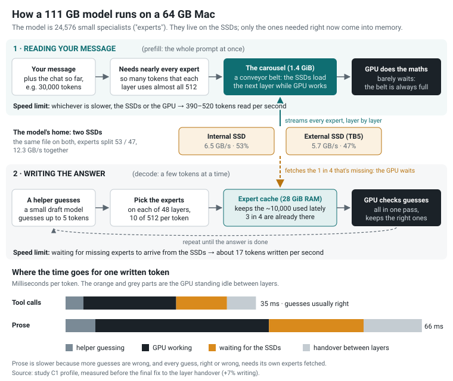
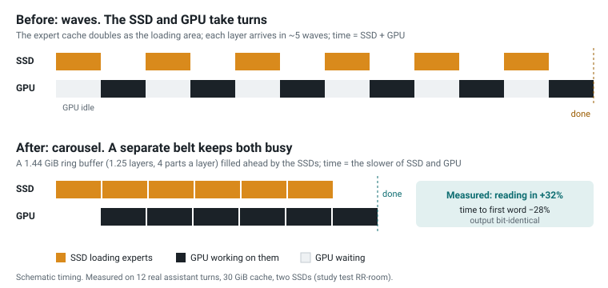
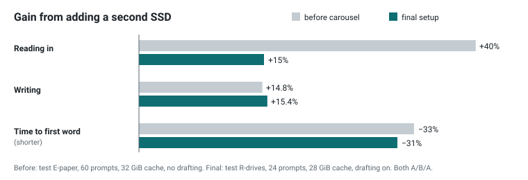
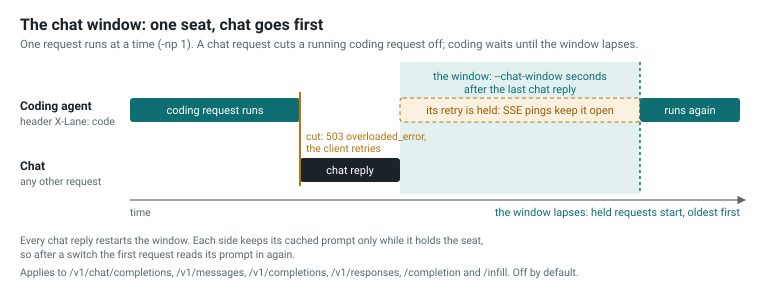

# Flash-Next SSD

**Run Qwen3.8-Flash-Next, a 111 GB model, on a 64 GB Mac.**

This is a [llama.cpp](https://github.com/ggml-org/llama.cpp) fork for Apple Silicon. The model is a
mixture of experts: 48 layers of 512 experts, and each token uses only 10 experts on each layer. So
the experts stay on the SSD. The ones a token needs are read in as it is computed, and the ones used
most stay in an expert cache in RAM. Everything else stays resident on the GPU.

It was tuned for a Mac mini M5 Pro with 64 GB and a second SSD over Thunderbolt 5. The tuning was
measured on real agent conversations, and any timing that swap touched was thrown out.

<p align="center"></p>

## Headline numbers

Measured on a Mac mini M5 Pro (64 GB) with Unsloth's UD-Q4_K_XL quant, a 28 GiB expert cache, two
SSDs and the MTP draft head on. Sources and method are in [Results](docs/flashnext/results.md).

| | |
|---|---|
| **Writing (decode)** | **17.5 tokens/s** across 120 real agent conversations replayed in order: +47% over the study's first setup (11.9) |
| **Time to first token** | **5.5 s** median: −52% (from 11.4 s) |
| **Reading a prompt (prefill)** | **523 / 430 / 391 tokens/s** at 4K / 32K / 100K tokens, from cold |
| **Writing after a 100K-token prompt** | **~21 tokens/s** |
| **Quality** | **18/20** on a fixed 20-task exam, the same score as the plain setup |

## What it adds

### SSD expert streaming with an expert cache

`--moe-stream` keeps the routed experts on disk and holds a fixed-size expert cache in RAM
(`--moe-stream-cache 28` = 28 GiB). Reads skip macOS's file cache (`--moe-stream-direct`), so the
cache and the rest of the system keep their memory, and many reads are in flight at once. While a
token is being written, the next layer's experts are fetched ahead of time; about 72% of those
guesses turn out right. The cache keeps the experts used most recently and most often. At 28 GiB
about 3 in 4 expert lookups find their expert already in RAM.

### The reading room: a carousel for long prompts

A long prompt needs nearly every expert on every layer. The reading room is a small ring buffer
(about 1.4 GiB) carved out of the expert cache. The SSDs fill it layer after layer, ahead of the
GPU, so prompt reading costs whichever of the two is slower, not both added together. The output
is bit-identical to having every expert in RAM. While writing, the buffer is lent back as extra
cache, which won back its cost (+5.5% writing). It is on by default.

<p align="center"></p>

### Two drives

Put a byte-identical copy of the model on a second SSD and the expert reads are split across both
by expert id (`--moe-stream-alt-path`, `--moe-stream-alt-split 53`). The internal SSD (6.5 GB/s)
and a 990 PRO over Thunderbolt 5 (5.7 GB/s) give 12.3 GB/s together. That made writing 15% faster
and cut the time to first token by 31%.

<p align="center"></p>

### The MTP draft head, at a depth it measures for itself

A small draft head guesses up to 5 tokens ahead, and the model checks them all in one pass
(`--spec-type draft-mtp-adaptive` with `LLAMA_SPEC_ADAPTIVE_RATE=1`). It picks its own guessing
depth from how often recent guesses were kept. On the agent conversations (tool calls, code) it
made writing 23% faster. On prose it breaks even, because every guess, right or wrong, needs its own experts
fetched. An optional token list (`LLAMA_MTP_VOCAB`) narrows what it guesses from, for another +2.6%.

### Union attention

The model's sparse attention picks the context blocks each query attends to. Union attention
shares one deduplicated pick list per batch while reading a prompt. At 160K context its working
memory drops from 5.6 GiB to 1.9 GiB, and prompt reading gets 5% faster. It sums in a different
order, so words can differ at near-ties; perplexity is unchanged. It is the default
(`LLAMA_QSA_UNION=1`).

### The chat window

One server, two users: a person chatting and a coding agent working in the background. With
`--chat-window 1200`, a chat request stops a running background request, which gets a 503 that its
client retries. Background requests then wait until 20 minutes after the last chat reply. Only the
background client needs to send a header (`X-Lane: code`). It is off by default.

<p align="center"></p>

### And smaller wins, all on by default

- The n-gram table's hot rows sit on a 128 MiB shelf instead of macOS's file cache (`--ple-shelf`, +3% writing).
- One prompt-cache checkpoint stays pinned at the start of the conversation, so a new chat after a
  long one resumes in 4 s instead of 14 s.
- Cheaper per-layer stops: less locking and lookup at each layer, the next layer's GPU work encoded
  ahead, and a tiny keep-awake ping so the GPU does not power down while it waits (+7% writing).

## Quick start

You need an Apple Silicon Mac with 64 GB, about 115 GB free on the internal SSD, Xcode's command
line tools and CMake. A second fast SSD is optional.

**1. Build**

```sh
git clone https://github.com/skeggsguy/Flash-next-ssd
cd Flash-next-ssd
cmake -B build -DGGML_METAL=ON -DCMAKE_BUILD_TYPE=Release
cmake --build build -j
```

**2. Download the model (111.3 GB, 4 files) and the draft head (1.9 GB)**

```sh
D=~/models/flashnext && mkdir -p $D
for i in 1 2 3 4; do
  curl -fL --retry 5 -C - -o $D/Qwen3.8-Flash-Next-UD-Q4_K_XL-0000$i-of-00004.gguf \
    https://huggingface.co/unsloth/Qwen3.8-Flash-Next-GGUF/resolve/main/UD-Q4_K_XL/Qwen3.8-Flash-Next-UD-Q4_K_XL-0000$i-of-00004.gguf
done
curl -fL --retry 5 -C - -o $D/mtp-shared-Q4_K_M.gguf \
  https://huggingface.co/nitinpanj/qwen38-flash-next-v3/resolve/main/MTP/mtp-shared-Q4_K_M.gguf
```

**3. Let the GPU wire enough memory** (this resets on every reboot)

```sh
sudo sysctl iogpu.wired_limit_mb=59392
```

**4. Run the server**

```sh
LLAMA_SPEC_ADAPTIVE_RATE=1 LLAMA_MOE_STREAM_ALLOC_CHUNK_MIB=4096 \
GGML_METAL_RESIDENCY_KEEP_ALIVE_S=10000000 \
./build/bin/llama-server \
  -m ~/models/flashnext/Qwen3.8-Flash-Next-UD-Q4_K_XL-00001-of-00004.gguf -ngl 99 \
  --moe-stream --moe-stream-cache 28 --moe-stream-io-threads 8 --moe-stream-direct \
  -md ~/models/flashnext/mtp-shared-Q4_K_M.gguf --spec-draft-ngl 99 \
  --spec-type draft-mtp-adaptive --spec-draft-n-max 5 --spec-draft-p-min 0.3 --spec-max-prompt 0 \
  -c 200000 -b 4096 -ub 4096 -cms 8192 -ctxcp 3 -np 1 -fa on \
  --cache-reuse 0 --cache-ram 0 --jinja --reasoning-format deepseek \
  --host 127.0.0.1 --port 8080
```

It loads in seconds; the first request is slower while the expert cache fills. Open
<http://127.0.0.1:8080>, or point any OpenAI-compatible client at `http://127.0.0.1:8080/v1`
(the Anthropic-style `/v1/messages` endpoint works too).

With a second SSD, copy the four model files to it and add
`--moe-stream-alt-path /Volumes/<ssd>/flashnext/Qwen3.8-Flash-Next-UD-Q4_K_XL-00001-of-00004.gguf --moe-stream-alt-split 53`.
To share the server with a coding agent, add `--chat-window 1200`.

This is the study's everyday command. Close memory-hungry apps while it runs: at a 28 GiB cache
the Mac has little room to spare. If you see swap (`sysctl vm.swapusage`), use a smaller cache or
context; [Memory sizing](docs/flashnext/memory-sizing.md) explains how to choose.

## Start it with one click

Once it is built and downloaded (steps 1-3 above), double-click one of these in Finder, in the
repo's folder:

- **`Start Flash-Next.command`**: the model on the internal SSD only.
- **`Start Flash-Next (two SSDs).command`**: the internal SSD and a copy on a second SSD
  ([Getting started](docs/flashnext/getting-started.md#3-the-second-drive-optional) explains the copy).

A Terminal window opens and runs the server with the everyday command from step 4, plus the chat
window (the table below). Keep the window open while you use it; to stop the server, press
Control-C or close the window.

Before it starts, it checks that the server is built, the model files are where the settings say,
the second drive is connected (two SSDs only) and no other server is running. If something is
missing, it says what to do and stops. It never starts a second server: two at once would push the
Mac into swap. To see the checks and the exact command without starting anything, run it from
Terminal with `--dry-run`:

```sh
./"Start Flash-Next (two SSDs).command" --dry-run
```

**Your settings** live in `flashnext.conf`, beside the start files. The first start makes it from
`flashnext.conf.example`; edit it in any text editor. It is yours: git ignores it, so pulling an
update never changes it. A setting you delete takes the example's value.

| Setting | Default | What it is |
|---|---|---|
| `MODEL` | `~/models/flashnext/Qwen3.8-Flash-Next-UD-Q4_K_XL-00001-of-00004.gguf` | The model's first file; the other three sit beside it. |
| `DRAFT_HEAD` | `~/models/flashnext/mtp-shared-Q4_K_M.gguf` | The MTP draft head. Empty (`DRAFT_HEAD=`) runs without it. |
| `SECOND_COPY` | `/Volumes/ssd/flashnext/...-00001-of-00004.gguf` | Two SSDs only: the first file of the copy on the second drive. |
| `SECOND_SPLIT` | `53` | Two SSDs only: the percent of experts read from the internal copy ([Settings](docs/flashnext/settings.md#two-drives)). |
| `CACHE_GIB` | `28` | The expert cache in GiB, the biggest speed setting ([Memory sizing](docs/flashnext/memory-sizing.md)). |
| `CONTEXT` | `200000` | The context in tokens. |
| `CHAT_WINDOW` | `300` | Seconds chat keeps the server after its last reply, when you share it with a coding agent ([The chat window](docs/flashnext/chat-window.md)); `0` = off. Without such an agent it changes nothing. |
| `PORT` | `8080` | The server's address is `http://127.0.0.1:PORT`. |

Everything else is fixed at the everyday values (the table in
[Getting started](docs/flashnext/getting-started.md#5-run) says what each is for). To change one of
those, run `llama-server` yourself with the options in [Settings](docs/flashnext/settings.md).

## Start at login (suggested)

To have the server start by itself whenever you log in, install it as a launchd agent:

```sh
tools/flashnext/install-autostart.sh            # internal SSD only
tools/flashnext/install-autostart.sh two-ssds   # or with the second drive
```

It checks your settings first, then copies a filled-in
`tools/flashnext/launchd/com.flashnext.server.plist.template` to
`~/Library/LaunchAgents/com.flashnext.server.plist` and starts the server in the background. Add
`--no-load` to wait for the next login instead. From then on, at every login it:

- runs the same checks and the same command as the start files, with the same `flashnext.conf`;
- waits until the Mac has been up 10 minutes, because opening a 28 GiB cache while macOS is still
  busy after a restart risks swap ([Memory sizing](docs/flashnext/memory-sizing.md#opening-the-model-safely));
- if the server fails or a check stops it (say the second drive isn't connected yet), tries again
  5 minutes later, but not after a clean stop;
- writes the server's log to `~/Library/Logs/flashnext/server.log`.

To stop it until the next login, and to start it again:

```sh
launchctl bootout gui/$(id -u)/com.flashnext.server
launchctl bootstrap gui/$(id -u) ~/Library/LaunchAgents/com.flashnext.server.plist
```

`tools/flashnext/uninstall-autostart.sh` stops it and removes the agent.

**It needs you logged in.** The GPU (Metal) works only in a logged-in session, so the agent starts
at login, not at power-on. For a Mac that should come back by itself after a power cut, turn on
automatic login (System Settings > Users & Groups; macOS offers it only with FileVault off, since
FileVault waits for your password at the unlock screen) and `sudo pmset -a autorestart 1` (start up
after a power failure). Install the wired-limit LaunchDaemon from
[Getting started](docs/flashnext/getting-started.md#4-the-gpus-wired-memory-limit) too, so the
limit is set at every boot.

## Guides

- [Getting started](docs/flashnext/getting-started.md): the steps above in detail, the second drive, and what a healthy start looks like.
- [Settings](docs/flashnext/settings.md): every option for this model, with its default, when to change it, and how to set it on the command line, as an environment variable or in an INI preset file.
- [Memory sizing](docs/flashnext/memory-sizing.md): choosing the expert cache and context on 64 GB and 48 GB Macs, and how to watch for swap.
- [The chat window](docs/flashnext/chat-window.md): sharing one server between chat and a coding agent.
- [Results](docs/flashnext/results.md): the measurements behind this README, and how they were taken.

The rest of llama.cpp works as upstream documents it: see [docs/](docs/) and
[the upstream README](https://github.com/ggml-org/llama.cpp#readme). npanj's notes on the model's
architecture and kernels are in [docs/Qwen3.8-Flash-Next.md](docs/Qwen3.8-Flash-Next.md), and the
README of his fork is kept as [docs/npanj-fork-README.md](docs/npanj-fork-README.md).

## Credits

This is a fork of a fork of a fork, and it stands on the work underneath it:

- [ggml-org/llama.cpp](https://github.com/ggml-org/llama.cpp) and ggml, by Georgi Gerganov and the
  llama.cpp contributors.
- [mihailescu2m/llama.cpp](https://github.com/mihailescu2m/llama.cpp) by Marian Mihailescu, the
  origin of MoE expert streaming (`--moe-stream`), phase-aware batching, the SSD context cache and
  MTP rejection sampling. Without that work none of this runs.
- [npanj/llama.cpp](https://github.com/npanj/llama.cpp), which brought streaming to
  Qwen3.8-Flash-Next on Apple Silicon: the model's graph and indexer work, the native MTP head, the
  Metal kernels, and the shared MTP draft head used here
  ([nitinpanj/qwen38-flash-next-v3](https://huggingface.co/nitinpanj/qwen38-flash-next-v3)).
- [Unsloth](https://huggingface.co/unsloth/Qwen3.8-Flash-Next-GGUF) for the UD-Q4_K_XL quant, and
  the Qwen team for the model.

This fork adds two-drive striping, the reading room, the measured-depth draft head and its token
list, union attention, the n-gram shelf, the pinned checkpoint, the cheaper per-layer stops and the
chat window, and the study that measured them.

## Licence

MIT, as upstream: see [LICENSE](LICENSE). Bundled third-party code keeps its own licences, listed
in [licenses/](licenses/).
